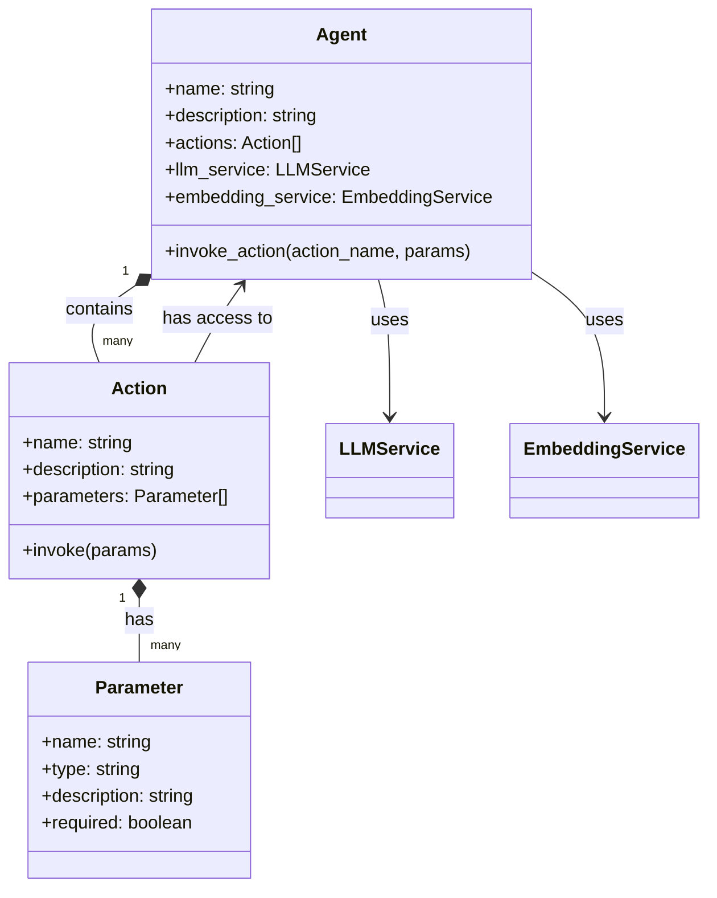

# Agents

Agents are specialized processing units within the Solace Agent Mesh framework that:

* perform specific tasks or provide domain-specific knowledge 
* play a crucial role in the system's ability to handle a wide range of tasks and adapt to various domains

:::tip[In one sentence]
Agents are essentially the system capabilities beyond basic LLM responses.
:::

## Key Functions

1. **Task Specialization**: Agents subscribe to specific task types and process them based on their specialized capabilities.

2. **AI-Enabled**: Agents can be AI-enabled and directly access large language or embedding models from the system.

3. **Dynamic**: New agents can self-register/deregister and be added to the system dynamically without requiring any changes to the running system.

4. **Independence**: Agents are modularized and can be updated or replaced independently of other components.


## Agent Design

An agent is a single entity that **has one or many actions**. Each action is a specific capability of the specific agent. 

Each agent also has access to make calls to the [LLM Service](../user-guide/advanced/services/llm-service.md) or the [Embedding Service](../user-guide/advanced/services/embedding-service.md), and actions can reach those services through the agent.



For example, if you have a SQL Database agent, it might have actions like `query`, `insert`, `update`, `delete`, etc. The `insert` action could be using the embedding service to vectorize the data before inserting it into the database or the `query` action could be using the LLM service to generate the SQL query based on the user input.

### The Agent Lifecycle

An agent in Solace Agent Mesh interacts with the [orchestrator](./orchestrator.md) and goes through the following four stages:

- **Register**: The agent is registered with the orchestrator. At this stage the agent description and the list of its available actions are registered with the orchestrator.

- **Close**: This is the idle state of the agent. When an agent is closed, its actions are hidden from the orchestrator. The orchestrator can decide to open an agent should it need to use one of its actions.

- **Open**: This is the active state of the agent. When an agent is open, its actions are visible to the orchestrator. The orchestrator can see the name, description, and required parameters of each action, and then choose to invoke an action.

- **Deregister**: The agent is deregistered from the orchestrator if it doesn't receive a heartbeat signal within a period of time. At this stage the agent description and the list of its available actions are removed from the orchestrator.


### Potential Agent Examples

- **RAG (Retrieval Augmented Generation) Agent**: An agent that can retrieve information based on a natural language query using an embedding model and vector database, and then generate a response using a language model.

- **External API Bridge**: An agent that acts as a bridge to external APIs, retrieving information from third-party services such as weather APIs or product information databases.

- **Internal System Lookup**: An agent that performs lookups in internal systems, such as a ticket management system or a customer relationship management (CRM) database.

- **Natural Language Processing Agent**: An agent that can perform tasks like sentiment analysis, named entity recognition, or language translation.


## Built-In Agents

Solace Agent Mesh comes with a set of built-in agents that provide essential capabilities out of the box. These agents can be activated or deactivated through the system configuration. For more information, see [Built-In Components](../getting-started/configuration.md#built-in-components).

Some of these agents are:

- **Global Agent**: Comes with a set of actions that provide useful functionalities, such as:
  - Plotly Graph: Generates a plotly graph from a given data.
  - PlantUML Diagram: Generates a PlantUML diagram from a given text.
  - File to Markdown: Converts files such as PDF, Word, etc. to markdown for the model to understand.
  - Create/Retrieve Files: Creates files or retrieves files for the [File service](../user-guide/advanced/services/file-service.md).

- **Web Request Agent**: Allows the system to make HTTP requests and search the web.

- **Image Processing Agent**: Provides image-processing capabilities such as describing an image (image-to-text) or generating an image from text (text-to-image).

## User-Defined Agents

Using Solace Agent Mesh and Solace Agent Mesh CLI, you can create your own agents to extend the system's capabilities. You can develop these agents in Python and dynamically add them to the system.

The following Solace Agent Mesh (SAM) CLI command creates an agent template for your agent, action, and YAML config file:

```sh
solace-agent-mesh add agent my-tool
```

For more information, see [Creating Custom Agents](../user-guide/custom-agents.md).

## Agent Plugins

You could also use agents built by the community or Solace directly in your app with little to no configuration. 

For more information, see [Use an Agent](./plugins/use-plugins.md#use-an-agent).

## Plugin-Sourced Agents

For the plugin agents that require more configuration, you can use the `add agent` command with the `--copy-from` option. This command copies the YAML configuration, but uses the plugin's Python code. If your desired agent name is different from the source agent name, use the format `<plugin>:<source_agent_name>` to specify the source agent.

```sh
solace-agent-mesh add agent my-plugin-tool --copy-from my-plugin
```

For more information, see [Copy from an Agent](./plugins/use-plugins.md#copy-from-an-agent).
