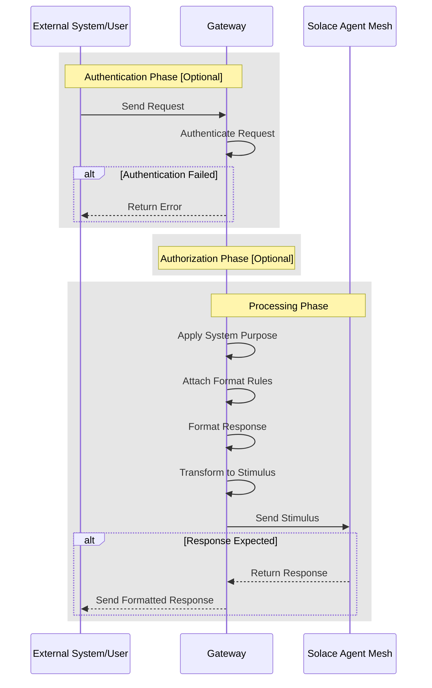

# Gateways

Gateways are a crucial component of the Solace Agent Mesh framework and provide the user interface to the Solace Agent Mesh that controls the system persona. Gateways provide the following functions:

- serve as the primary interface between Solace Agent Mesh and the outside world
- manage the flow of information in and out of the system, ensuring secure and efficient communication

:::tip[In one sentence]
Gateways are essentially the user interface to Solace Agent Mesh that controls the system persona.
:::

## Key Functions

1. **Entry Points**: Gateways act as the entry points from the outside world into Solace Agent Mesh, allowing external systems and users to interact with the framework.

2. **Configurable System Purpose**: Each gateway has a configurable system purpose that sets the context for all stimuli entering the Solace Agent Mesh through that gateway. This design allows for tailored processing based on the specific use case or domain.

3. **Customizable Output Formatting**: Gateways have a configurable output description that controls how stimuli responses are formatted when sent back to the outside world. This configurable output description ensures that the output meets the requirements of the receiving system or user interface.

4. **Multiple Interface Types**: Gateways can have different interfaces to accommodate various communication protocols and systems. Some examples include REST APIs, event meshes, Slack integrations, browser-based interfaces, etc.

## How Gateways Work

The following diagram illustrates the complete flow of information through a gateway in Solace Agent Mesh:



## Available Gateways

Solace Agent Mesh comes with two built-in gateway interfaces called `REST Endpoint` and `Web UI`. Additionally, you can use other official core plugins to utilize other gateway types or create your own custom gateways.

For more information about plugins and how to configure them, see [Plugins](./plugins/index.md).

One of the official core plugin gateway interfaces is the [Solace Event Mesh Gateway](https://github.com/SolaceLabs/solace-agent-mesh-core-plugins/tree/main/solace-event-mesh), which enables communication with the PubSub+ event broker directly as an input interface.

:::note
Each gateway type has its own configuration options and specific features. See the individual gateway documentation pages for detailed information on setup and usage.
:::

## Create a Gateway

To create a gateway, you can either use one of the pre-existing interfaces, or create yours from scratch.

### Gateway from Interfaces

To create a gateway from an existing interface, use the `add gateway` command and pass an array of interfaces you want to use. For example, to create a new REST API gateway, you can run the following command:

```sh
solace-agent-mesh add gateway --interface rest-api my-rest-api
```

:::tip
Don't use the word `gateway` in the name for the gateway as it will automatically get prefixed at build time.
:::

This command creates two files. One for the gateway configuration and another for the interface configuration.

You can find them in the `configs/gateways/my_rest_api` directory. (The `configs` directory is specific to your configuration, so it might be another name in your case.)

That's it!

:::info[Using interfaces from plugins]
Once a plugin is added to a project, it is automatically loaded into the list of available interfaces. So it'd be the same steps to add a new gateway from a plugin interface.
:::

### Gateway from Scratch

To create a gateway from scratch, you need to use the CLI `add gateway` command without any interfaces. This command creates a _python gateway template file_ which you can then customize to your needs.

```sh
solace-agent-mesh add gateway my-interface
```

To learn more about creating your own gateway, see [Create Custom Gateways](../user-guide/custom-gateways.md).

:::tip[Share and Reuse]
If you would like to share your custom gateway with the community or re-use it within other projects, you can create a plugin for it. For more information, see [Create Plugins](./plugins/create-plugin.md).
:::
