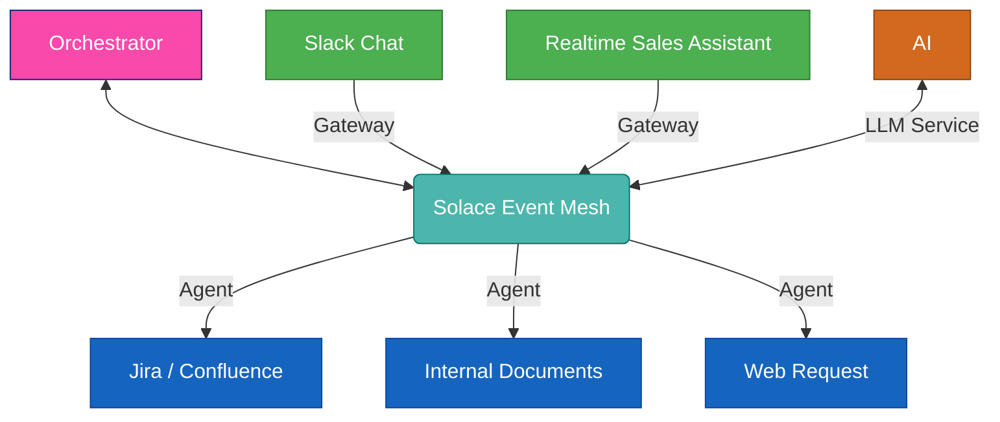

# Orchestrator

The orchestrator is the central system in Solace Agent Mesh that plays a crucial role in managing the overall workflow of requests. It acts as the central coordinator for processing complex, multi-step workflows while maintaining security, efficiency, and scalability.

:::tip[In one sentence]
The orchestrator is essentially the central intelligence that manages the overall workflow of requests in Solace Agent Mesh.
:::

## Key Functions

The orchestrator provides the following key functions:

1. **Request Analysis and Action Planning**:

   - Receives high-level goals or requests
   - Analyzes them in the context of available actions registered by agents in the system
   - Uses state-of-the-art generative AI techniques to plan a sequence of actions to fulfill the request

2. **Task Creation and Distribution**:

   - Creates tasks based on the action plan
   - Distributes tasks to appropriate agents
   - Enables efficient parallel processing and optimal resource utilization

3. **Workflow Management**:

   - Tracks outstanding tasks
   - Aggregates responses from various agents
   - Ensures all parts of a complex request are processed and combined coherently

4. **Response Formatting**:
   - Formats aggregated responses suitable for the gateway
   - Ensures the final output meets the requirements of the specific use case or interface

## Interaction with Other Components

The orchestrator interacts closely with several other components in Solace Agent Mesh using the [PubSub+ event broker](https://solace.com/products/event-broker/):

- **[Agents](./agents.md)**: Distributes tasks to and receives responses from various agents.
- **[Gateways](./gateways.md)**: Receives initial requests from and sends final responses to gateways.

By centralizing these critical functions, the orchestrator enables Solace Agent Mesh to handle complex, multi-step workflows while maintaining efficiency, and scalability.
