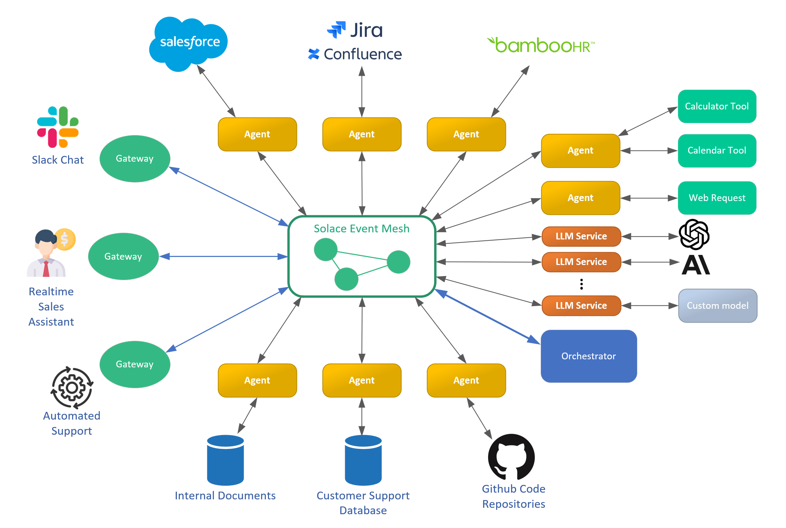

# Introduction

Modern AI development faces a fundamental challenge: while powerful AI models are readily available, the real complexity lies in connecting them to the data and systems where they can provide value. Data exists in isolated silos - spread across databases, SaaS platforms, APIs, and legacy systems - making it difficult to build AI applications that can work across these boundaries.

Solace Agent Mesh (SAM) is an open-source framework that tackles this challenge head-on. It provides a flexible foundation for building AI applications where multiple agents can collaborate, each bringing their own specialized capabilities and data access. Whether you're an AI enthusiast experimenting with new models, or an enterprise developer building production systems, SAM gives you the tools to:

- connect AI agents to real-world data sources and systems
- add gateways to provide event-based integrations or interactive UI connections
- monitor and debug AI interactions in real-time
- deploy solutions that scale from prototype to production

Rather than trying to be a monolithic AI platform, SAM focuses on being an excellent integration layer. It brings together specialized agents - whether they're using local databases, accessing cloud APIs, or interfacing with enterprise systems - and helps them collaborate to solve complex problems.

Built on event-driven architecture technology from Solace, SAM provides the robust foundation needed for both experimental and production deployments.

## Why Use Solace Agent Mesh?

Building production-ready AI applications presents unique challenges. While it's relatively easy to create AI prototypes, deploying them in enterprise environments requires solving complex problems around integration, scalability, and observability. Solace Agent Mesh provides a framework to address these challenges through:

- **Composable architecture**: Start with a small number of agents and gateways. You can add more over time.

- **Addition of agents to increase capabilities**: Each new agent adds more capabilities to the system. Adding a new agent isn't additive - it is exponential. With each agent being able to enhance all other agents as they collaborate for more and more complex tasks.

- **Addition of gateways to increase the supported use cases**: Each new gateway opens up new use cases for the system. A new gateway can provide a new interface to the system, with a different system purpose and response rules.
- **Event-driven design**: Built on proven event-driven architecture principles, providing complete decoupling of components. This makes the system highly flexible and resilient, while enabling real-time monitoring of every interaction.

- **Enterprise-ready**: Engineered from the ground up for production deployment, this solution leverages expertise from Solace in building mission-critical distributed systems.

## Real-World Applications

Solace Agent Mesh is flexible and enables a wide range of use cases, such as:

- **Autonomous Operations**: Automatically create JIRA tickets from system alerts, enriched with contextual data.
- **Intelligent Assistants**: Build chat interfaces that can access and act on enterprise data.
- **Data Analysis**: Generate custom reports and visualizations by combining data from multiple sources.
- **Document Processing**: Extract, analyze, and route information from various document types.

## Evolution Through Usage

Solace Agent Mesh grows with your needs. For example, at Solace we started with basic agents and have continuously expanded the system's capabilities:

- Added specialized agents for JIRA and Confluence integration
- Implemented multiple interface options including browser-based user interfaces and REST API gateways
- Integrated with various AI models and data sources

## For Developers

Solace Agent Mesh is an agentic framework that provides several key technical advantages:

- **Complete Observability**: Because all communication flows through the event broker, you can monitor and debug the entire system in real-time
- **Flexible Integration**: Built-in support for common enterprise systems and AI frameworks
- **Plugin Architecture**: Easily extend the system with custom agents and gateways
- **Developer Tools**: Comprehensive CLI and debugging utilities

## Getting Started

Whether you're building a proof-of-concept or planning a production deployment, Solace Agent Mesh provides the foundation you need. For more information, see:

- [Installation](./installation.md): For installing and setting up Solace Agent Mesh.
- [Quick Start](./quick-start.md): For creating a project, build, and run Solace Agent Mesh.
- [Components Overview](./component-overview.md): Understand the parts of Solace Agent Mesh.
